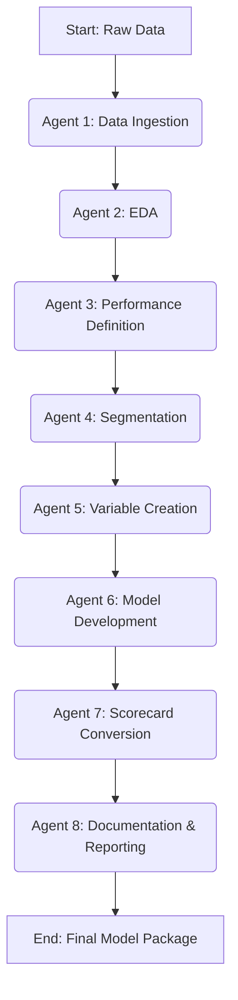

# A2A Credit Risk Modeling Pipeline

This project is a proof-of-concept for a fully automated, agent-based credit risk modeling pipeline. It uses an Automate-to-Automate (A2A) architecture where specialized AI agents handle each stage of the model development lifecycle, from data ingestion to final documentation. The goal is to drastically reduce model development time while maintaining strict governance through Human-in-the-Loop (HITL) review gates.

## Problem Statement

Traditional credit risk model development is a slow, manual, and resource-intensive process. It often takes months to complete, involves repetitive tasks, and can suffer from inconsistencies between projects. This pipeline aims to automate the tedious aspects, freeing up analysts to focus on high-value strategic decisions.

## The Agentic Architecture

The core of this project is an "Agentic Modeling Crew"—a team of digital specialists that collaborate to build a model. Each agent performs a specific task and hands off its artifacts to the next agent in the sequence. Between each handoff, a human analyst can review the results, provide feedback, or approve the transition to the next stage.



## Pipeline Stages & Current Status

This repository contains a functional, simplified end-to-end pipeline. The following agents have been implemented:

-   **Agent 1: Data Ingestion:** Loads multiple raw data files, aggregates supplementary information, and merges them into a single analytical base table.
-   **Agent 2: EDA (Exploratory Data Analysis):** Automatically profiles the merged data and generates a detailed interactive HTML report for review.
-   **Agent 3: Performance Definition:** Formally defines the dependent variable (`TARGET`) and the business objective for auditing purposes.
-   **Agent 4: Segmentation:** Segments the customer base into `NEW_CUSTOMER` and `EXISTING_CUSTOMER` groups and analyzes their risk profiles.
-   **Agent 5: Variable Creation:** Cleans the data by systematically imputing missing values and creates new, derived features (e.g., financial ratios).
-   **Agent 6: Model Development:** Performs one-hot encoding for categorical features, splits the data, trains a separate `LogisticRegression` model for each segment, and evaluates their performance (AUC).
-   **Agent 7: Scorecard Conversion:** Calculates the scaling parameters (`Factor`, `Offset`) needed to convert the model's probability output into a human-readable score.
-   **Agent 8: Documentation & Reporting:** Gathers all artifacts from the pipeline and synthesizes a final model documentation report and a deployable package.

*Note: A more complex `FeatureEngineeringAgent` using WOE/IV was prototyped but has been temporarily bypassed in the main workflow to ensure a robust, end-to-end run.*

## How to Run This Project

### Prerequisites
-   Python 3.10+
-   Git
-   A virtual environment tool (e.g., `venv`)

### 1. Clone the Repository
```bash
git clone https://github.com/pradeep2479/model-builder-A2A.git
cd model-builder-A2A
```

### 2. Set Up the Environment
```bash
# Create a virtual environment
python3 -m venv venv

# Activate it
source venv/bin/activate

# Install all dependencies
pip install -r requirements.txt
```

### 3. Download the Data
The workflow expects the data from the [Kaggle: Home Credit Default Risk](https://www.kaggle.com/competitions/home-credit-default-risk/data) competition.

1.  Download the data from the link above.
2.  Create a `data` folder in the project root.
3.  Unzip and place all the `.csv` files from Kaggle into the `data/` folder.

### 4. Run the Full Simplified Pipeline
The `main_workflow.py` script is designed to run the entire simplified pipeline from end to end.

```bash
python scripts/main_workflow.py
```
This will run all 8 agents in sequence and produce the final output in the `outputs/09_documentation/deployment_package/` directory.

## Next Steps
The vision for this project includes:
-   **Containerization:** Packaging the application with Docker for portability.
-   **Orchestration:** Migrating the workflow to a production-grade orchestrator like Prefect or Airflow.
-   **Advanced Modeling:** Re-integrating a WOE/IV feature engineering agent and adding challenger models like XGBoost.
-   **LLM Integration:** Adding a top-level LLM "CEO" to plan and trigger pipeline runs based on natural language commands.